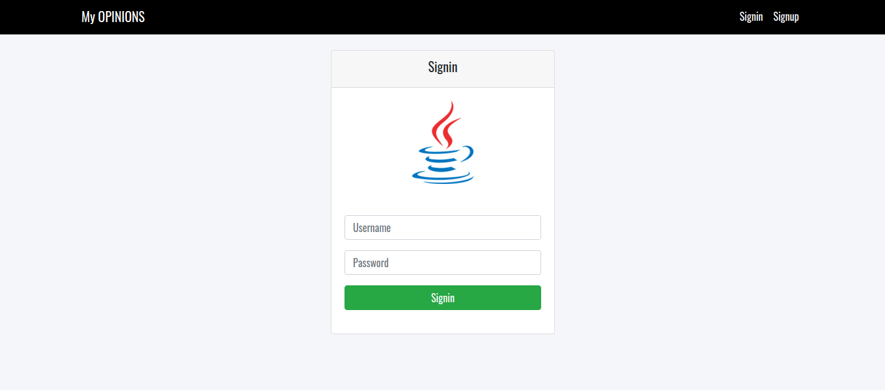
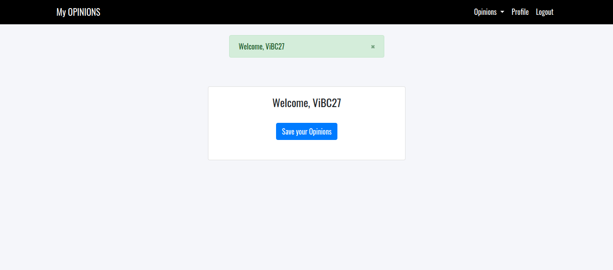
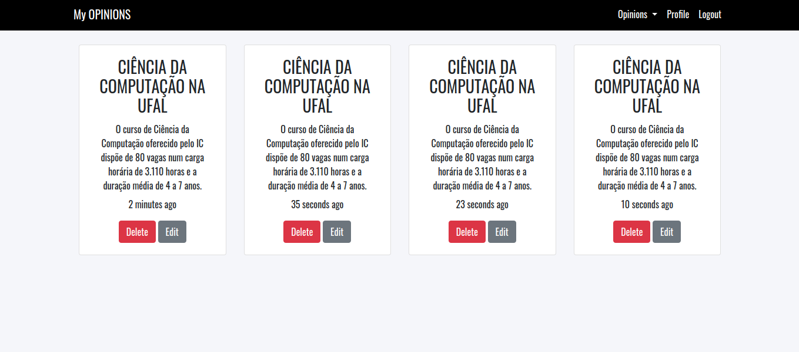

## Identificação

* Discente:
	* Nome: Vitor Barcelos de Cerqueira
	* Matrícula: 18110271 

Bem vindo!
Esse repositório contém os arquivos do projeto Web. O projeto, basicamente, consiste em criar uma aplicação de notas, onde o usuário pode realizar a adição, atualização e remoção dessas notas. Essas notas na aplicação também são chamadas de opiniões do usuário. Alguns recursos incluídos:

* Sistema de Autenticação(Signin e Signup) com criptografia;
* Adição de notas/opiniões;
* Remoção de notas/opiniões;
* Edição de notas/opiniões;
* Página Profile;
* Página Home;
* Página Opiniões;
* etc.

Esse projeto utiliza os seguintes recursos:

* Node Js;
* Express Js;
* Handlebars;
* Bcrypt Js;
* Mysql;
* etc.

## Manual

* Node Js, NPM e Mysql instalados;
* Nova Database: './database/db.sql';
* Rodar npm run dev;

## Imagens

## Motivação

Esse projeto foi motivado pelo professor Baldoino Fonseca da disciplina Programação 3 2019.1 do curso de Ciência da Computação - UFAL(Universidade Federal de Alagoas).
